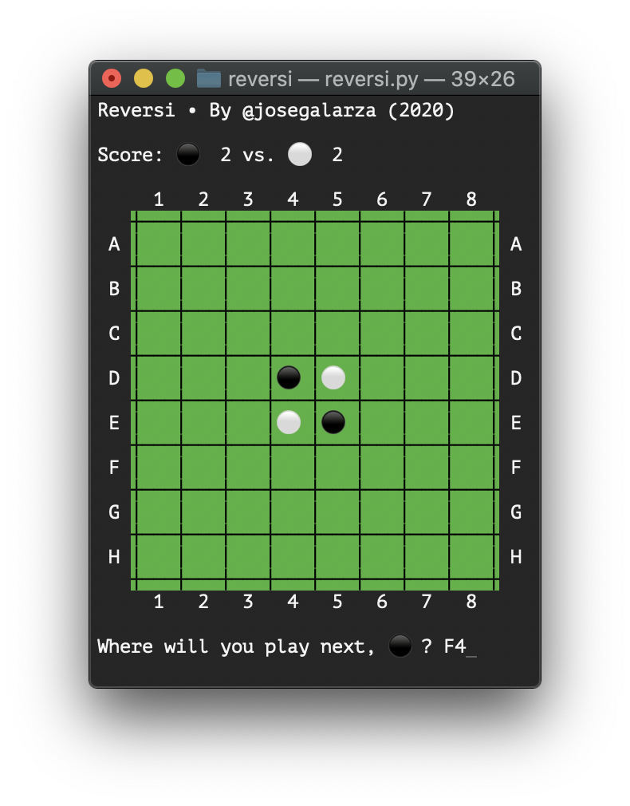
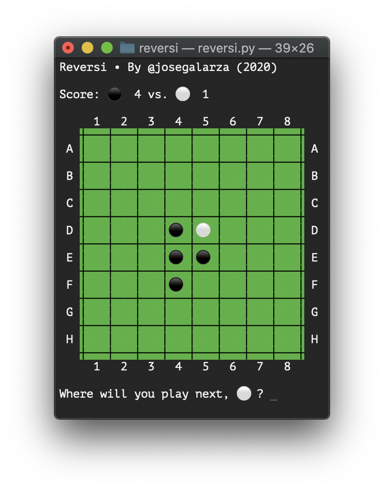

# Reversi

Python implementation of [Reversi](https://en.wikipedia.org/wiki/Reversi)

## How to play

Run the Python script:

```bash
python reversi.py
```

The initial board will be shown and the players will start playing in turns.

Player `⚫️` goes first, let's say it plays a valid move, for example `F4`.


 
The game will update the board with the player's move.

I will then be the turn of the next player (assuming it can move).



For the actual rulese on how to play this game, visit the Wikipedia site.

## Releases

## v1.2

- Better UI - square board

## v1.1

- Better UI - colored board, emojis and score count
- Fix bug of invalid input moves

## v1.0

- Players take turn to play
- Handler for bad input
- Evaluates an input move is valid or not
- Game ends when the board is full
- Game ends if one player has "dominated", the other player is not longer in the board

## TODO

- Handle cases where the game ends before the grid is completely filled
- Python2 compatible
